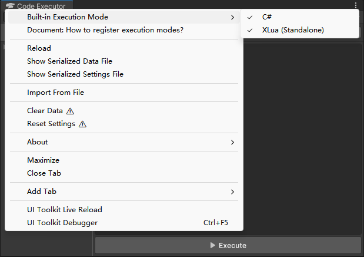
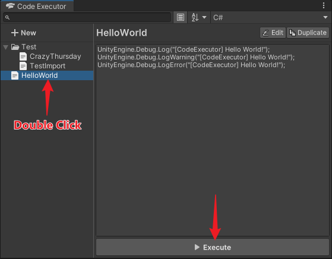
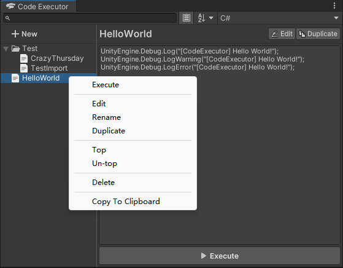

# Code Executor

[中文文档](README_ZH.md)

## Introduction

### What is this project

This is a Unity editor plugin project.

This plugin provides a front-end interface where you can create, edit, save, select execution mode and execute code snippets.


### What can it do

1. Dynamically execute code snippets in Edit Mode.
2. Dynamically execute code snippets in Play Mode.

### Supported programming languages

Although the plugin has built-in programming language back-end examples for C# and Lua (xLua).

But the plugin does not impose any restrictions on the programming language backend!

You can dynamically register (inject) execution modes for any programming language through the API provided by the plugin.

Built-in execution mode examples:

- C#: [InjectorCSharp.cs](Editor/Scripts/Examples/CSharp/InjectorCSharp.cs), [ExecutionHelperCSharp.cs](Editor/Scripts/Examples/CSharp/ExecutionHelperCSharp.cs)
- xLua (Standalone): [InjectorXLua.cs](Editor/Scripts/Examples/XLua/InjectorXLua.cs), [ExecutionHelperXLua.cs](Editor/Scripts/Examples/XLua/ExecutionHelperXLua.cs)
- xLua (Custom): [InjectorXLuaCustom.cs](Editor/Scripts/Examples/XLua/InjectorXLuaCustom.cs)

The built-in execution modes are enabled by default, you can disable them in the window's menu.



### How to register execution modes

The project provides a `CodeExecutorRegistration` attribute to register execution modes, which has the ability to control the order of registration.

> This attribute essentially uses the `InitializeOnLoadMethod` attribute provided by Unity, so you can also register execution modes directly using the `InitializeOnLoadMethod` attribute, but there is no control over the order of multiple modes.

```csharp
#if UNITY_EDITOR
using ChenPipi.CodeExecutor.Editor;
using UnityEditor;

public static class Example
{

    [CodeExecutorRegistration]
    private static void Register()
    {
        CodeExecutorManager.RegisterExecMode(new ExecutionMode()
        {
            name = "New ExecMode",
            executor = ExecuteCode,
        });
    }

    private static object[] ExecuteCode(string code)
    {
        // Execute code here
        return new object[] { };
    }

}
#endif
```

After successful registration, the name of the mode will appear in the drop-down list of the Execution Mode menu at the top right of the Code Executor window, and can be used to execute code snippets.


#### Register by reflection

If you want to avoid directly referencing the `ChenPipi.CodeExecutor.Editor` namespace in your own project code, you can implement the registration through C# reflection.

Please refer to [ReflectionAPI.cs](Editor/Scripts/Examples/ReflectionAPI.cs) provided within the project.

## Installation

### Install from Package Manager (Recommend)

1. Open the **Package Manager** Window.
2. Open the **add(+)** menu in the Package Manager's toolbar.
3. Select **Add package from git URL** from the add menu.
4. Enter **the Git URL of this project (with `.git` suffix)** in the text box and click **Add** button.

Learn more on [https://docs.unity3d.com/Manual/upm-ui-giturl.html](https://docs.unity3d.com/Manual/upm-ui-giturl.html)

### Manually install

Download and put the **Whole Project** in your project's Assets folder (or any subfolder would be ok).

## Usage

### Open the window

Select the `Window > Code Executor` option in the Unity editor menu bar.

### Create Snippet

Clicking on the **New** item at the top left of the window switches you to the New state, where you can edit and execute a temporary snippet.

In addition, you can save the current content as a new snippet and save it in the snippet list by clicking the **Save** button at the top right of the code editing area.


### Execute Snippet

1. Click the **Execute** button below the code editing area to execute the current code snippet
2. Move your mouse to any item in the snippet list, click the ▶️ button on the right side of the item to execute the snippet



### Edit Snippet

After selecting any item in the snippet list, the code editing area will enter the read-only state, then you can view or copy the code text.

If you need to modify the code of current snippet, click on the **Edit** button at the top right of the code editing area.

Switching to another snippet will enter the read-only state again.


### Rename Snippet

Select any item in the snippet list, press the **F2** key to rename the snippet.


### Copy Snippet

If you want to copy the current snippet, click the **Copy** button at the top right of the code editing area.

Then you will get an exact copy of the current snippet.


### Snippet Menu

Right-click on any item in the snippet list will display a menu with the following options:

- Execute
- Edit
- Rename
- Duplicate
- Top
- Un-top
- Delete



### Copy/Paste Snippets

- Press **Ctrl+C** to save the selected snippets in the snippet list to the system clipboard as Json format text.
- Press **Ctrl+V**, the program will try to parse the content from the system clipboard, and all valid snippets will be saved to the snippet list.

By this way, you can quickly swap snippets between different Unity editors.

### Reference Snippets

To make it easier to reuse existing code snippets, the code editor supports a simple import syntax.

Simply add the `@import("SnippetName")` statement to the code, and the plugin will replace the corresponding import statement with the code text of the target snippet before executing the code.

Here is a example~

Currently, we have a snippet called "CrazyThursday" with the following code text:

```csharp
UnityEngine.Debug.LogError("[CodeExecutor] Crazy Thursday");
```

Then we import the "CrazyThursday" snippet in other code using the import syntax:

```csharp
@import("CrazyThursday")
UnityEngine.Debug.LogError("[CodeExecutor] V Me 50");
```

the code will be parsed as:

```csharp
UnityEngine.Debug.LogError("[CodeExecutor] Crazy Thursday");
UnityEngine.Debug.LogError("[CodeExecutor] V Me 50");
```

The import syntax also supports nesting.

But! Be careful! Circular references will destroy the world!

### Shortcut keys

- `Ctrl+F`: Focus to search field
- `F2`: Rename the first selected asset
- `F5`: Reload data and settings
- `Delete/Backspace`: Delete selected snippets
- `Ctrl+C`: save the selected snippets in the snippet list to the system clipboard as Json format text
- `Ctrl+V`: Try parsing the content from the system clipboard, and all valid snippets will be saved to the snippet list.

## Screenshots/Animations

To be added...

## Compatibility

This project is compatible with the following versions of the Unity Editor:

- 2020.2 and later

### Testing details

| Unity Version     | Tested | Note |
|-------------------|--------|------|
| Unity 2020.2.5f1  | ✔️     |      |
| Unity 2021.2.16f1 | ✔️     |      |
| Unity 2021.3.8f1  | ✔️     |      |
| Unity 2021.3.15f1 | ✔️     |      |
| Unity 2021.3.22f1 | ✔️     |      |
| Unity 2021.3.27f1 | ✔️     |      |
| Unity 2021.3.29f1 | ✔️     |      |

## Dependencies

| Package | Version | Note |
|---------|---------|------|
| None    | None    |      |

## License

This project is licensed under the [MIT license](https://opensource.org/licenses/MIT).
