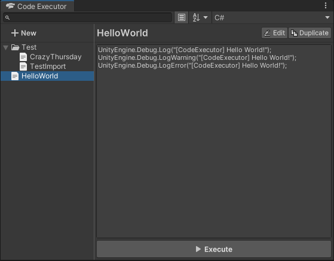
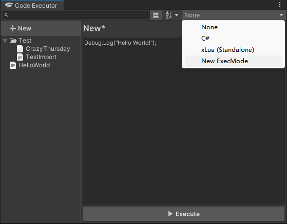
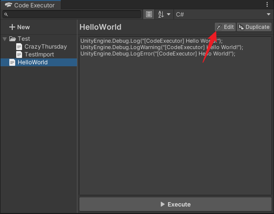

# Code Executor

[English Document](README.md)

## 项目介绍

### 这是什么项目？

这是一个 Unity 编辑器插件项目。

本插件提供了一个可以新建、编辑、保存、选择代码执行模式并执行代码段的前端界面。



### 可以用来做什么？

1. 在编辑器编辑状态（Edit Mode）下动态执行代码段
2. 在编辑器运行状态（Play Mode）下动态执行代码段

### 支持什么编程语言？

本插件内置了 C# 和 Lua (xLua) 的语言后端示例。

但是本插件没有对语言后端做任何限制，你可以通过本插件提供的 API 动态地注册（注入）任意编程语言的执行模式。

内置的示例：

- C#: [InjectorCSharp.cs](Editor/Scripts/Examples/CSharp/InjectorCSharp.cs)、[ExecutionHelperCSharp.cs](Editor/Scripts/Examples/CSharp/ExecutionHelperCSharp.cs)
- xLua (Standalone): [InjectorXLua.cs](Editor/Scripts/Examples/XLua/InjectorXLua.cs)、[ExecutionHelperXLua.cs](Editor/Scripts/Examples/XLua/ExecutionHelperXLua.cs)
- xLua (Custom): [InjectorXLuaCustom.cs](Editor/Scripts/Examples/XLua/InjectorXLuaCustom.cs)

内置的执行模式默认开启，你可以在窗口的菜单中禁用它们。


### 如何注册执行模式？

项目提供了 `CodeExecutorRegistration` 特性（Attribute）来注册自定义执行模式，该特性拥有控制注册顺序的能力。

> 该特性本质上使用了 Unity 提供的 `InitializeOnLoadMethod` 特性，所以你也可以直接使用 `InitializeOnLoadMethod` 特性来注册执行模式，但是无法控制多个注册模式间的注册顺序。

```csharp
#if UNITY_EDITOR
using ChenPipi.CodeExecutor.Editor;
using UnityEditor;

public static class Example
{

    [CodeExecutorRegistration]
    private static void Register()
    {
        CodeExecutorManager.RegisterExecMode(new ExecutionMode()
        {
            name = "New ExecMode",
            executor = ExecuteCode,
        });
    }

    private static object[] ExecuteCode(string code)
    {
        // Execute code here
        return new object[] { };
    }

}
#endif
```

注册成功后，该执行模式的名称将出现在 Code Executor 窗口右上方执行模式菜单的下拉列表中，选中即可使用该模式来执行任意代码段。



#### 通过反射来注册？

如果你想要避免在项目代码中直接引用 `ChenPipi.CodeExecutor.Editor` 命名空间，你可以通过 C# 反射来实现同样的注册逻辑。

请参考项目内提供的 [ReflectionAPI.cs](Editor/Scripts/Examples/ReflectionAPI.cs)。

## 安装方法

### 从 Package Manager 安装（推荐）

1. 打开 **Package Manager** 窗口
2. 点击窗口左上角的 **+** 按钮
3. 选择弹出菜单中的 **Add package from git URL** 选项
4. 输入该项目的 Git 链接（需带 `.git` 后缀）并点击 **Add** 按钮

相关文档 [https://docs.unity3d.com/Manual/upm-ui-giturl.html](https://docs.unity3d.com/Manual/upm-ui-giturl.html)

### 手动安装

下载该项目，放到你的 Unity 项目中的 Assets 文件夹下（也可以放在任意子文件夹下）。

## 使用指南

### 打开主窗口

在 Unity 编辑器菜单栏中选择 `Window > Code Executor` 菜单项。

### 新建代码段

点击窗口左上方的 New 条目即可切换至新建状态，你可以在此处编辑、执行临时的代码段。

另外，点击代码编辑区域右上方 Save 按钮，即可将当前的内容保存为新的代码段，并在代码段列表中展示。


### 执行代码段

1. 点击代码编辑区域下方的 Execute 按钮即可执行当前代码段
2. 将鼠标移动到代码段列表中的某一条目，点击条目右侧的▶️按钮即可执行对应的代码段


### 编辑代码段

在代码段列表中选择任意代码段后，代码区域将进入只读状态，你可以查看或复制代码文本。

如需修改该代码段的代码文本，请点击代码编辑区域右上方 Edit 按钮。

切换到其他代码段将会再次进入只读状态。



### 重命名代码段

在代码段列表中选择任意代码段后，按下 F2 键修改代码段的名称。


### 拷贝代码段

如需快速拷贝当前代码段，请点击代码编辑区域右上方 Copy 按钮。

此操作将会生成一个与当前代码段完全相同的副本。


### 代码段菜单

鼠标右键点击代码段列表中的条目将会展示菜单，包含以下选项：

- 执行（Execute）
- 编辑（Edit）
- 重命名（Rename）
- 复制（Duplicate）
- 置顶（Top）
- 取消置顶（Un-top）
- 删除（Delete）


### 快速复制/粘贴代码段

- 键盘按下 Ctrl+C 组合键，即可将当前代码段列表中选择的代码段以 Json 格式文本的方式保存到系统剪贴板
- 键盘按下 Ctrl+V 组合键，将会尝试解析系统剪贴板中的内容，并将有效的代码段保存到代码段列表中

你可以通过这种方式来快速地在不同的 Unity 编辑器间交换代码段。

### 引用代码段

为了方便复用已有代码段，代码编辑器支持一种简易的导入语法。

只需在代码中添加 `@import("代码段名称")` 语句，插件就会在执行代码前先使用目标代码段的代码文本替换对应的导入语句，再调用对应执行模式的执行函数。

下面举个例子~

当前我们拥有一个名为「CrazyThursday」的代码段，其代码文本为：

```csharp
UnityEngine.Debug.LogError("[CodeExecutor] Crazy Thursday");
```

然后我们在其他代码中使用导入语法来导入「CrazyThursday」代码段：

```csharp
@import("CrazyThursday")
UnityEngine.Debug.LogError("[CodeExecutor] V Me 50");
```

这段代码在执行前会被解析为：

```csharp
UnityEngine.Debug.LogError("[CodeExecutor] Crazy Thursday");
UnityEngine.Debug.LogError("[CodeExecutor] V Me 50");
```

同时该导入语法支持嵌套。

但是！请注意不要循环引用！！！

### 快捷键

- `Ctrl+F`: 聚焦到搜索栏
- `F2`: 重命名代码段列表中选择的代码段
- `F5`: 重新加载数据和设置
- `Delete/Backspace`: 删除代码段列表中选择的代码段
- `Ctrl+C`: 将当前代码段列表中选择的代码段以 Json 格式文本的方式保存到系统剪贴板
- `Ctrl+V`: 尝试解析系统剪贴板中的内容，并保存有效的代码段

## 截图/演示动画

待补充...

## 兼容性

本项目兼容以下 Unity 编辑器版本：

- 2020.2 及更高版本

### 测试细节

| Unity 版本          | 是否通过测试 | 备注  |
|-------------------|--------|-----|
| Unity 2020.2.5f1  | ✔️     |     |
| Unity 2021.2.16f1 | ✔️     |     |
| Unity 2021.3.8f1  | ✔️     |     |
| Unity 2021.3.15f1 | ✔️     |     |
| Unity 2021.3.22f1 | ✔️     |     |
| Unity 2021.3.27f1 | ✔️     |     |
| Unity 2021.3.29f1 | ✔️     |     |

## 依赖

| 包名  | 版本  | 备注  |
|-----|-----|-----|
| 无   | 无   |     |

## 开源许可

This project is licensed under the [MIT license](https://opensource.org/licenses/MIT).
